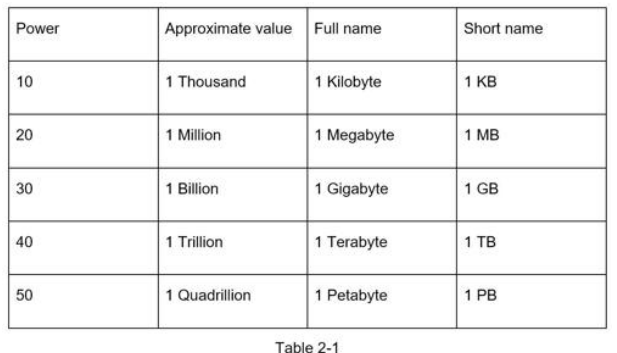
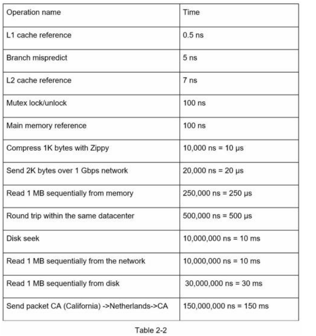
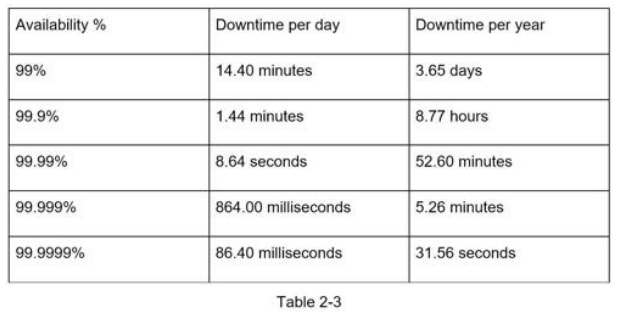

• Memory is fast but the disk is slow.
• Avoid disk seeks if possible.
• Simple compression algorithms are fast.
• Compress data before sending it over the internet if possible.
• Data centers are usually in different regions, and it takes time to send data between them.

