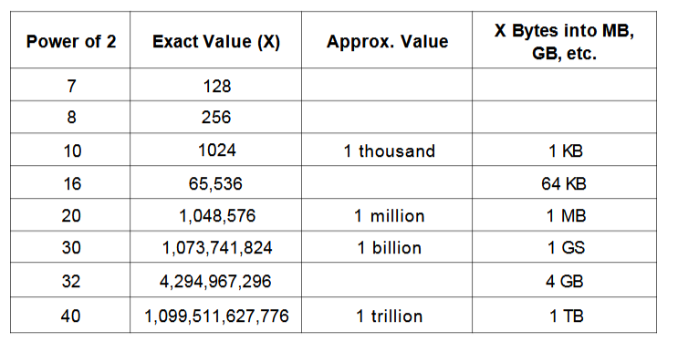

### Technical Questions
- Try solving the problem on your own
- Write the code on paper
- Test your code
- Type it out

Solving a problem flow:

1. Listen
- record any unique information in the problem, information on the whiteboard
2. Example
- Specific: It should use real numbers or strings (if applicable to the problem), Sufficiently Large: Most example are too small. by about 50%, not a special case: be careful, its very easy to inadvertently draw a special case, no special cases
3. Brute Force
- come up with a brute force approach, It's okay that this initial solution is terrible. Explain what the space and time complexity is, and then dive into improvements
4. Optimize : bottlenecks, Unnecessary Work, Duplicated Work
- look for any unused information, use a fresh example, solve it correctly, make time vs space tradeoff, precompute the information, use a hash table, think about the best conceivable runtime
5. Test
- a moment to solidify your understanding of the algorithm,
6. Implement
- Write beautiful code (Modularize your code, error checks, use other classes/structs where appropriate); if you get confused go back to the example and walk through the example and the algorithm together and work it out
7. Walkthrough
- test the code in the interview, you always test the code in real life so should you in the interview; conceptual testing, weird looking code, hot spots (bases cases in recursive code, integer division, null node in binary tree, start and end in the double linked list), small test cases when testing your code, special cases
Optimization Techniques: Look for BUD, Do it yourself, Simplify and Generalize, Base Case and Build (base case and build algorithms often lead to natural recursive algorithms), Data Structure Brainstorm (run through each of the data structure that come to head and try each one against the problem and try to resolve it),

Always try to consider the best conceivable runtime
Always write modular code means separating isolated chunks of code into their own methods, helps keep the code more maintainable, readable, and testable

pg 108
